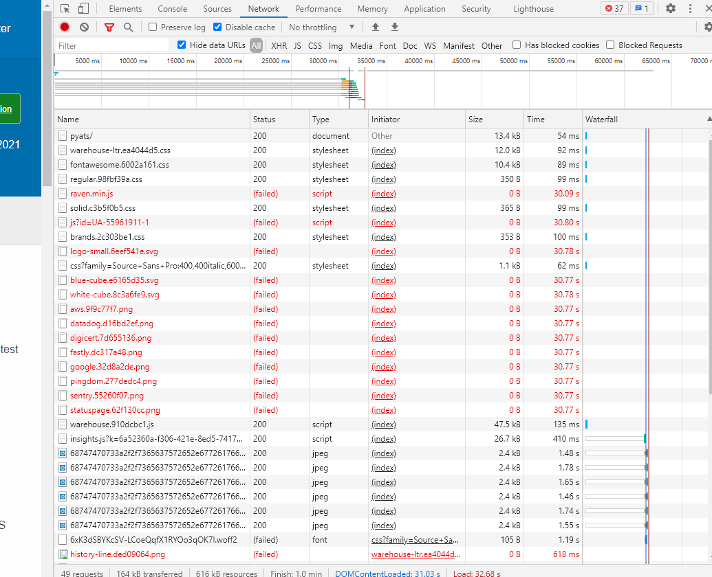

### Bug Report Title: ###

Some page resources failed to load on first opening light page								

---

**Bug Report ID:** 001

**Severity:** High

**Description:**

Loading light web page with enabled proxy causes data loosing. Some web page resources failed to load like: pictures, css or javascript.

**Blocks:** TC32, TC33, TC34, TC35, TC36, TC37

---

**Steps to reproduce:**

___

|      ID       | Steps/Actions |  Expected Result | Actual Result |
| :------------ |:--------------| :---------- | :-------------- |
|       1       | Execute Test Case ID-003 (disable proxy) |  |  |
|       2       | In the URL field paste url (https://pypi.org/project/pyats) and press enter | Page resources loaded | Page resources loaded (picture 1)|
|       3       | From the "Network" tab of DevTools record the number of failed requests as R0 | |  |
|       4       | Execute Test Case ID-002 (enable proxy) |  |  |
|       5       | In the URL field paste url (https://pypi.org/project/pyats) and press enter | Page resources loaded | Some page resources failed to load (picture 2) |
|       6       | From the "Network" tab of DevTools record the number of failed requests as R1 and compare to R0 | R1 = R0 | Values are not equal  |

---
###Attachments: ###
### picture 1 ###

### picture 2 ###
