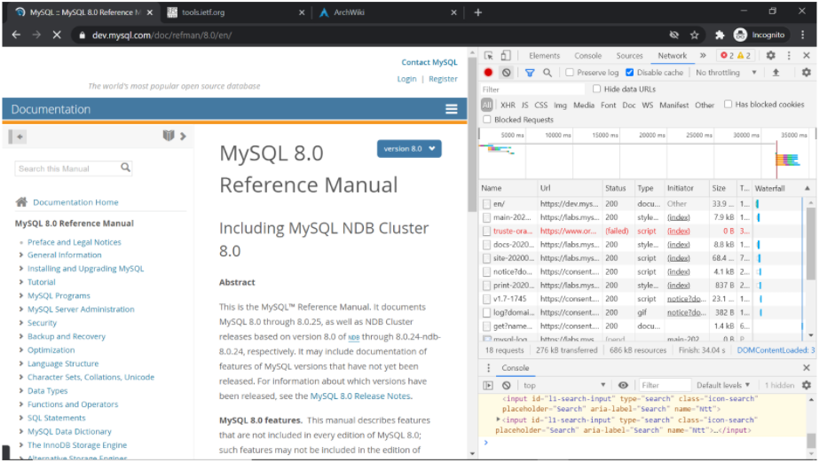
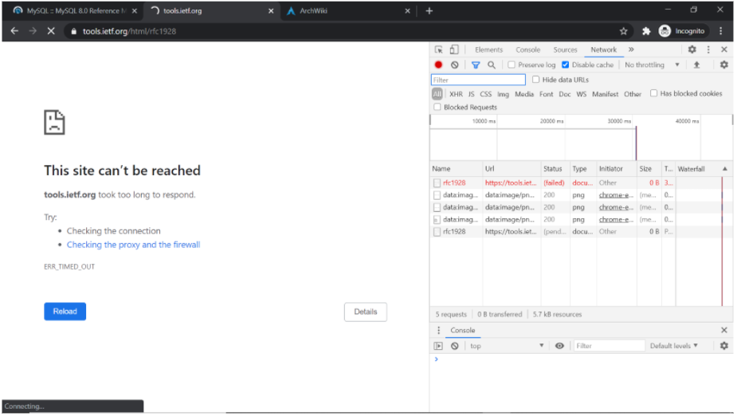
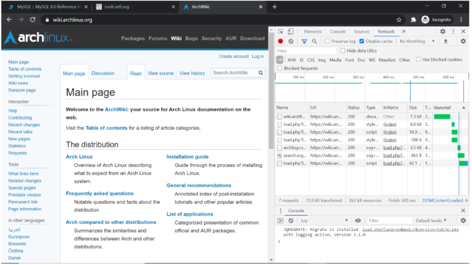
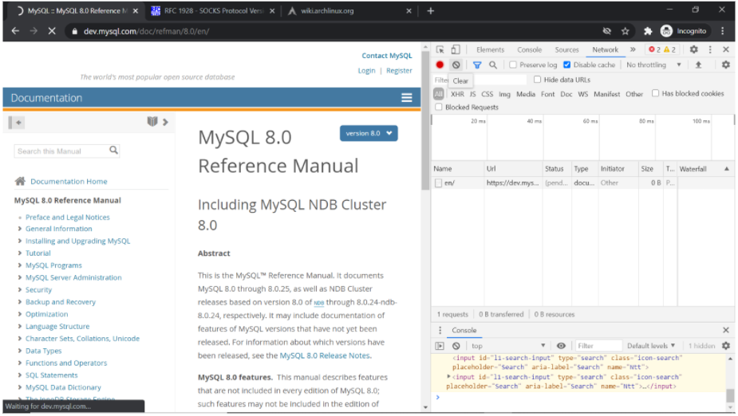
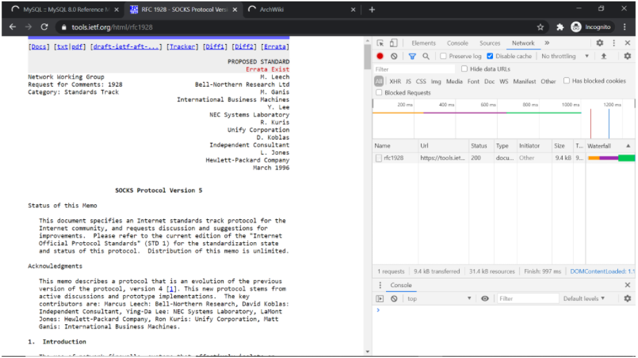
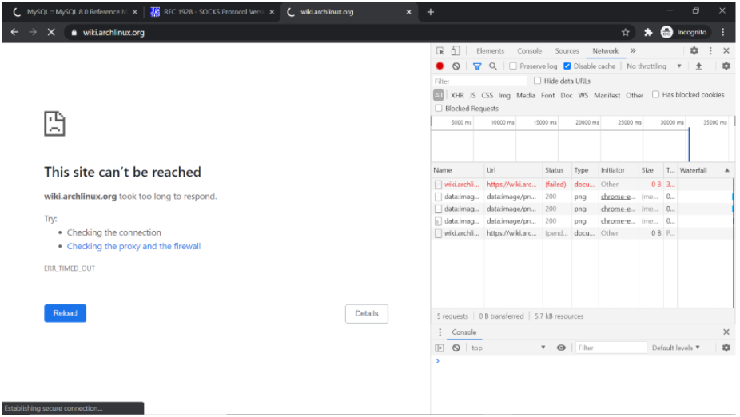

### Bug Report Title: ###

Multiple tabs loading in Chrome is unstable								

---

**Bug Report ID:** 005

**Severity:** High

**Description:**

Simultaneous loading of multiple tabs in Chrome is unstable. 
Three webpages of super-light class were used to test test 
this issue:  
1. https://dev.mysql.com/doc/refman/8.0/en/  
2. https://tools.ietf.org/html/rfc1928  
3. https://wiki.archlinux.org/  

All pages were loaded simultaneously as result web page https://tools.ietf.org/html/rfc1928   failed to load
with the timeout error ERR_TIMED_OUT (screenshot 1.2).
After re-running the test case similar behaviour was observed, but with web page https://wiki.archlinux.org/ (screenshot 2.3)

**Affects:** TC18

---

**Steps to reproduce:**

___

|      ID       | Steps/Actions |  Expected Result | Actual Result |
| :------------ |:--------------| :---------- | :-------------- |
|       1       | Execute Test Case ID-002 |  |  |
|       2       | Open 3 tabs in the browser   tab1: https://wiki.archlinux.org/  tab2: https://tools.ietf.org/html/rfc1928    tab3: https://dev.mysql.com/doc/refman/8.0/en/ | Pages loaded | Page have timeout error (see description)|

---
###Attachments: ###

  |Screenshot 1.1|Screenshot 1.2|Screenshot 1.3|
  |:-------------|:-------------|:-------------|
  |  | |  |

  |Screenshot 2.1|Screenshot 2.2|Screenshot 3.3|
  |:-------------|:-------------|:-------------|
  |  | |  |

