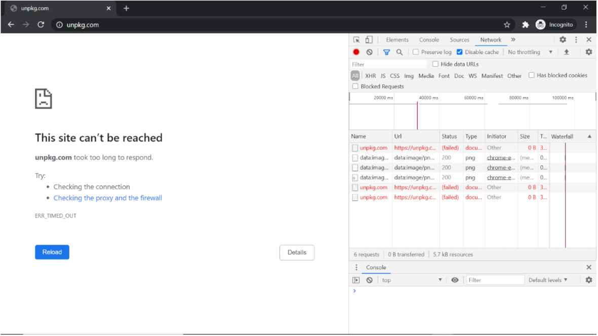
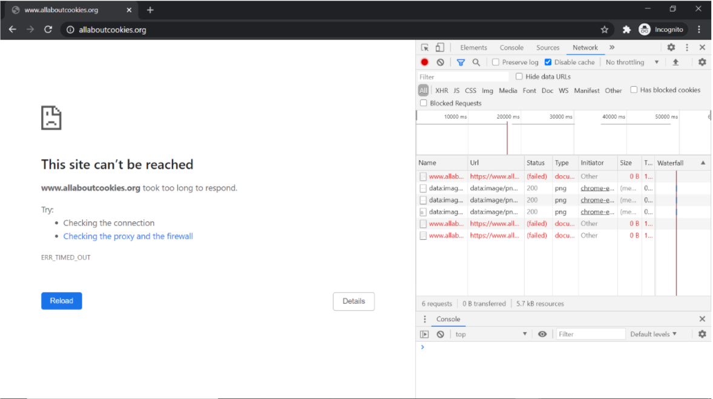
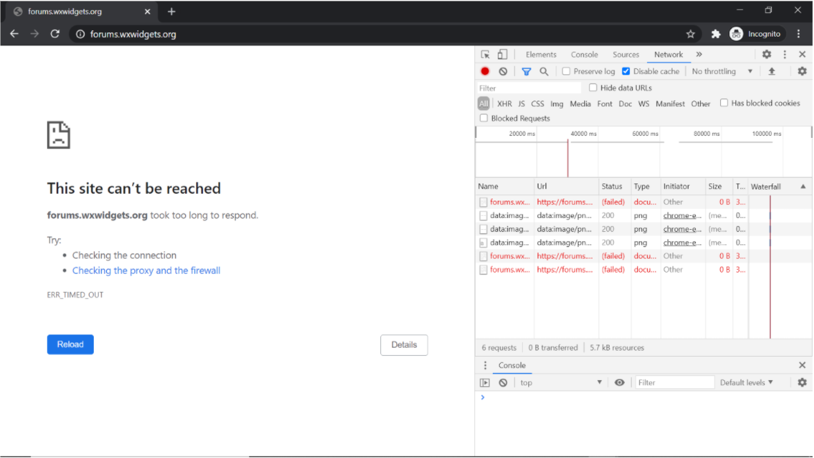

### Bug Report Title: ###

Proxy server is not able to establish connection to the websites hosted on Cloudflare								

---

**Bug Report ID:** 006

**Severity:** High

**Description:**

When trying to connect to websites hosted on Cloudflare with the Chrome browser timeout error appears (ERR_TIMED_OUT). Consequent connection request 
resending has no effect and website remains inaccessible. Test case was run with three websites hosted on Cloudflare:  
1. https://unpkg.com/ 
2. https://www.allaboutcookies.org/ 
3. https://forums.wxwidgets.org/ 

**Affects:** TC43

---

**Steps to reproduce:**

___

|      ID       | Steps/Actions |  Expected Result | Actual Result |
| :------------ |:--------------| :---------- | :-------------- |
|       1       | Execute Test Case ID-002 |  |  |
|       2       | In the URL field paste https://unpkg.com/ and press enter | Page loaded | Timeout error (screenshot 1)|
|       3       | In the URL field paste https://www.allaboutcookies.org/ and press enter | Page loaded | Timeout error (screenshot 2)|
|       4       | In the URL field paste https://forums.wxwidgets.org/ and press enter | Page loaded | Timeout error (screenshot 3)|

---

###Attachments: ###

  |Screenshot 1|
  |:-------------|
  |  |

  |Screenshot 2|
  |:-------------|
  |  |

  |Screenshot 3|
  |:-------------|
  |  |